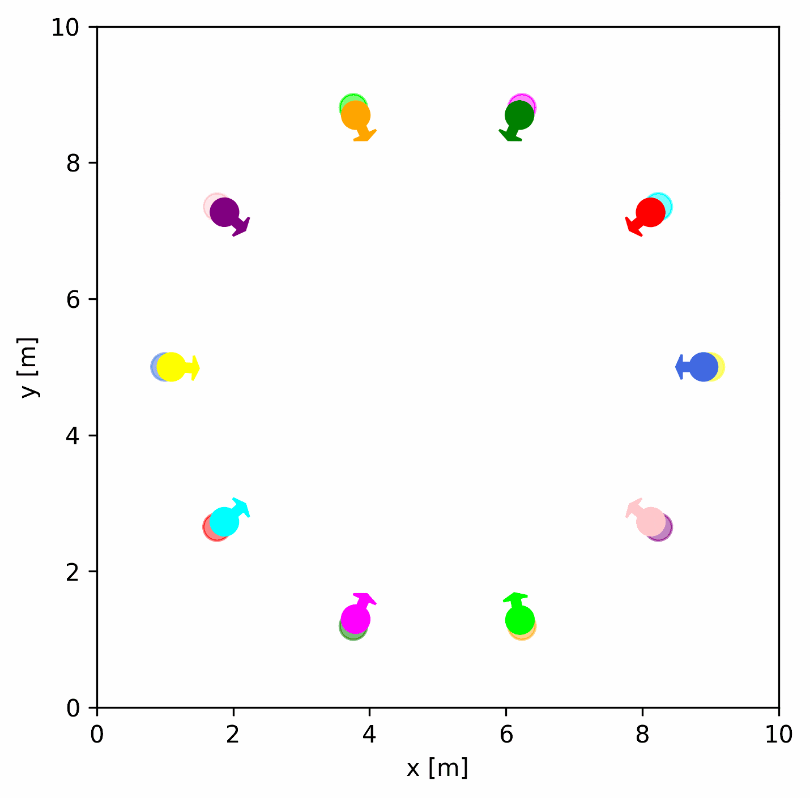

<div align="center">

</div> 

# Intelligent Robot Simulator (IR-SIM)

IR-SIM is an open-source, lightweight robot 2D simulator based on Python, specifically designed for intelligent robotics navigation and learning. Primarily intended for research and educational purposes, it is user-friendly and easily customizable.

It provides the following features:
  - A versatile and easy-to-use framework for simulating a variety of robot platforms with kinematics and sensors. 
  - Customizable configurations and parameters using yaml files.
  - Real-time visualization of simulation outcomes.
  - Ideal for developing and testing algorithms related to robot navigation, motion planning, reinforcement learning.


Robot             |  Car
:-------------------------:|:-------------------------:
  |  


## Prerequisite

- Python: >= 3.9

## Installation

- Install this package by pip:

```
pip install ir_sim
```

- or install manually: 

Clone and install the package

```
git clone https://github.com/hanruihua/ir_sim.git    
cd ir_sim   
pip install -e .  
```

## Usage

The usage guidelines are listed in the [ir_sim/usage](https://github.com/hanruihua/ir_sim/tree/main/ir_sim/usage)

## Cases
- [rl-rvo-nav](https://github.com/hanruihua/rl_rvo_nav)(RAL & ICRA2023)
- [RDA_planner](https://github.com/hanruihua/RDA_planner)（RAL & IROS2023）


## Contact: 
hanrh@connect.hku.hk


